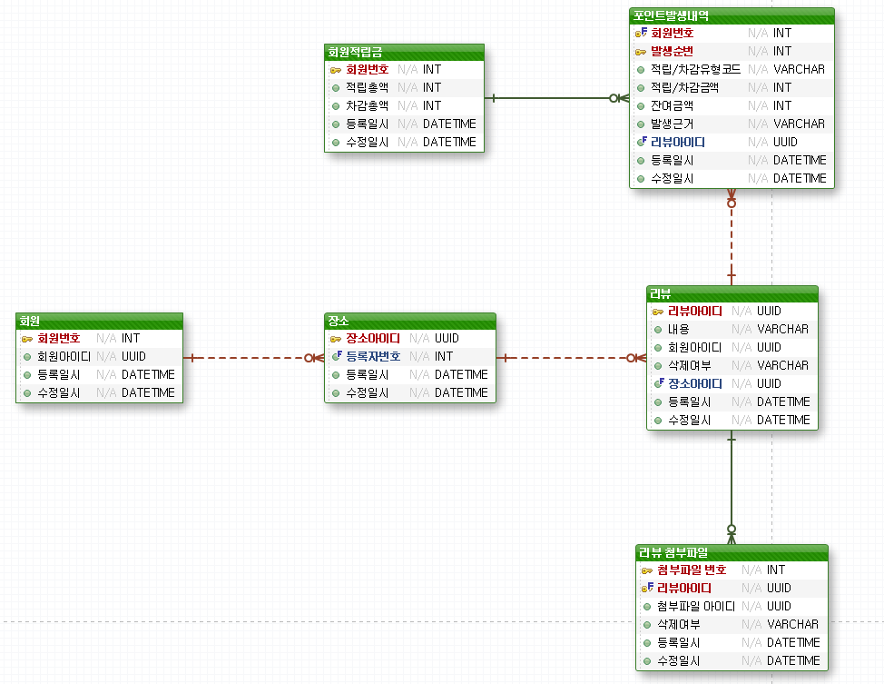
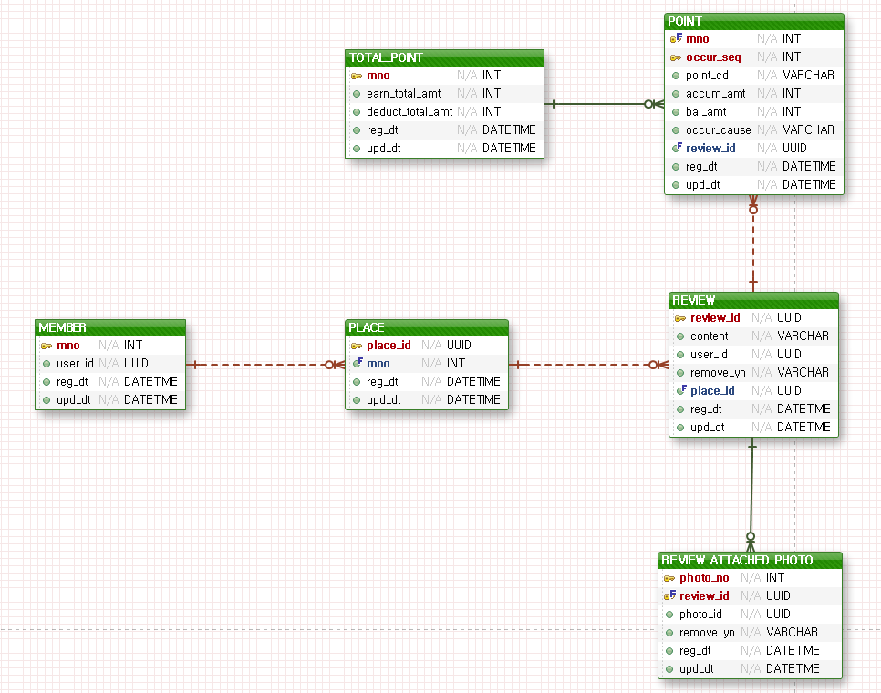

# 과제. 트리플 여행자 클럽 마일리지 서비스

## 여행자의 장소 리뷰시 포인트를 부여 및 히스토리를 관리하기 위한 서비스

## Swagger 주소
http://localhost:8080/swagger-ui/index.html

## 요구사항

<details>
<summary>요구 사항</summary>
<div markdown="1">

✅ 한 사용자는 장소마다 리뷰를 1개만 작성할 수 있다.

✅ 리뷰는 수정 및 삭제할 수 있다.

✅ 리뷰 작성 보상 점수
```text
* 내용 점수   
    - 1자 이상 텍스트 작성: 1점   
    - 1장 이상 사진 첨부: 1점   

* 보너스 점수   
    - 특정 장소에 첫 리뷰 작성: 1점   
```
✅ 포인트 증감이 있을 때마다 이력이 남아야 한다.

✅ 리뷰 작성했다가 삭제시 해당 리뷰로 부여한 내용 점수와 보너스 점수 회수합니다.

✅ 리뷰를 수정하면 수정한 내용에 맞는 내용 점수를 계산하여 점수를 부여하거나 회수합니다.

    * 글만 작성한 리뷰에 사진을 추가하면 1점을 부여합니다.
    * 글과 사진이 있는 리뷰에서 사진을 모두 삭제하면 1점을 회수합니다.

✅ 사용자 입장에서 본 첫 리뷰일 때 보너스 점수를 부여합니다.

    * 어떤 장소에 사용자 A가 리뷰를 남겼다가 삭제하고 삭제된 이후 사용자 B가 리뷰를 남기면 사용자 B에게 보너스 점수를 부여합니다.
    * 어떤 장소에 사용자 A가 리뷰를 남겼다가 삭제하는데 삭제되기 이전 사용자 B가 리뷰를 남기면 사용자 B에게 보너스 점수를 부여하지 않습니다.

✅ 포인트 부여 API 구현에 필요한 SQL 수행 시 전체 테이블 스캔이 일어나지 않는 인덱스가 필요합니다.    

</div>
</details>

## 개발환경(Dependency)
- Java 8+
- Spring Boot 2.7.1
- Spring Web MVC
- Spring Validation
- Spring Data JPA
- Swagger
- h2
- Mysql 8.0.29
- Docker
- Gradle

## 프로젝트 패키지 구조
패키지 구조는 전체적으로 쉽게 파악하기 위해 같은 layer 끼리 묶어 계층형 구조로 구성하였습니다.
```bash
📦java
 ┗ 📂com
 ┃ ┗ 📂triple
 ┃ ┃ ┗ 📂triplehomework
 ┃ ┃ ┃ ┣ 📂common
 ┃ ┃ ┃ ┣ 📂config
 ┃ ┃ ┃ ┣ 📂controller
 ┃ ┃ ┃ ┣ 📂dto
 ┃ ┃ ┃ ┣ 📂entity
 ┃ ┃ ┃ ┣ 📂exception
 ┃ ┃ ┃ ┣ 📂handler
 ┃ ┃ ┃ ┣ 📂repository
 ┃ ┃ ┃ ┣ 📂service
 ┃ ┃ ┃ ┣ 📂swagger
 ┃ ┃ ┃ ┗ 📜App.java
```
## 프로젝트 실행

### - 도커 설치
- [Window](https://docs.docker.com/desktop/windows/install/)

- [Mac](https://docs.docker.com/desktop/mac/install/) 또는 홈브루 사용시 brew install --cask docker
### - DB
<details>
<summary>DB</summary>
<div markdown="1">

```
1. docker run -d --name triple-mysql -p 3306:3306 -e MYSQL_ROOT_PASSWORD=1 -e MYSQL_DATABASE=triple mysql --character-set-server=utf8mb4 --collation-server=utf8mb4_unicode_ci
2. docker exec -it triple-mysql bash
3. mysql -u root -p
4. 1

5. create user triple@'%' identified by 'pass';

6. grant all privileges on *.* to 'triple';

7. flush privileges;

8. DB 툴을 이용하여 해당 유저로 접속
  - User: triple
  - Password: pass
  - Database: triple
9. DDL.sql, data.sql 소스 실행
```

</div>
</details>

### - 애플리케이션

<details>
<summary>애플리케이션</summary>
<div markdown="1">

```
git clone https://github.com/jongwoo-Lim/triple-homework.git
cd triple-homework

./gradlew clean build 또는 ./gradlew clean build -x test (테스트 스킵)
cd ./build/libs/

H2 인메모리 DB 사용
  java -jar -Dspring.profiles.active=test triple-homework-0.0.1-SNAPSHOT.jar 
MySql DB 사용
  java -jar triple-homework-0.0.1-SNAPSHOT.jar 
```

</div>
</details>


## API

- 리뷰 수정/삭제시 등록된 리뷰 아이디를 통해 요청해 주시면 됩니다.
- 리뷰 삭제시 removePhotoYn 필드를 추가하였으며 "Y"일 경우 요청 필드의 첨부파일만 삭제 되도록 구현하였습니다.

|Method|Path|Body|Description|
|------|---|-----------|----------|
|POST|/events| {<br/>"type": "REVIEW",<br/>"action": "ADD", <br/>"reviewId": "",<br/>"content": "좋아요!",<br/>"attachedPhotoIds": ["e4d1a64e-a531-46de-88d0-ff0ed70c0bb8", "afb0cef2-851d-4a50-bb07-9cc15cbdc332"],<br/>"userId": "3ede0ef2-92b7-4817-a5f3-0c575361f745",<br/>"placeId": "2e4baf1c-5acb-4efb-a1af-eddada31b00f"<br/>} |리뷰 추가|
|POST|/events| {<br/>"type": "REVIEW",<br/>"action": "MOD", <br/>"reviewId": "240a0658-dc5f-4878-9381-ebb7b2667772",<br/>"content": "너무 좋아요!!!",<br/>"attachedPhotoIds": ["e4d1a64e-a531-46de-88d0-ff0ed70c0bb8", "afb0cef2-851d-4a50-bb07-9cc15cbdc332"],<br/>"userId": "3ede0ef2-92b7-4817-a5f3-0c575361f745",<br/>"placeId": "2e4baf1c-5acb-4efb-a1af-eddada31b00f"<br/>} |리뷰 내용 수정 및<br/>첨부파일 추가|
|POST|/events| {<br/>"type": "REVIEW",<br/>"action": "DELETE, <br/>"reviewId": "240a0658-dc5f-4878-9381-ebb7b2667772",<br/>"content": "",<br/>"attachedPhotoIds": ["e4d1a64e-a531-46de-88d0-ff0ed70c0bb8", "afb0cef2-851d-4a50-bb07-9cc15cbdc332"],<br/>"userId": "3ede0ef2-92b7-4817-a5f3-0c575361f745",<br/>"placeId": "2e4baf1c-5acb-4efb-a1af-eddada31b00f",<br/> "removePhotoYn" : "N" <br/>} |리뷰 삭제<br/> 또는 <br/> 첨부파일 삭제|
|GET|/member/{userId}/point| |회원 포인트 <br/>조회

## 테스트용 데이터

### 회원
|mno|user_id|
|------|------------------------------------|
|999994|ef540baf-d99e-4e99-97ab-179099e1c1e7|
|999995|0615af95-20bc-4054-9b60-8dba9928c22f|
|999996|4f2c6c16-0231-4d8e-9bc2-1f64f6e671dd|
|999997|98abfce5-6540-41a4-9c89-0ffa06c6e05f|
|999998|45b29c7a-afa6-4c81-af8d-d8f3b10121a0|
|999999|3ede0ef2-92b7-4817-a5f3-0c575361f745|

### 장소
|place_id|mno|
|-----------------------------------|-------|
|11ecfb56-c15a-1c46-8b49-4113d19dad89|999999|
|11ecfb56-c168-2607-8b49-dfe4239c2faf|999999|
|11ecfb56-c172-d468-8b49-d5df7fd01594|999999|
|11ecfb56-c179-8b29-8b49-831f4e169e79|999999|
|11ecfb56-c181-ef9a-8b49-712075a48633|999999|
|2e4baf1c-5acb-4efb-a1af-eddada31b00f|999999|


## ERD

### 논리명

### 물리명

